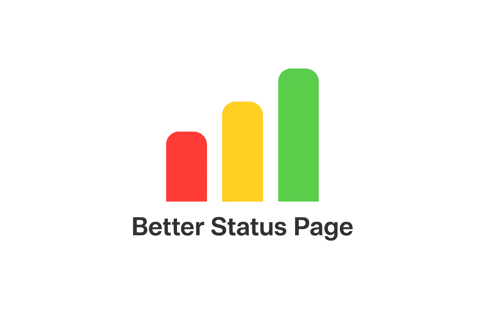

<div align="center">

<picture>
  <source media="(prefers-color-scheme: dark)" srcset="apps/status/public/logo_dark.png">
  <source media="(prefers-color-scheme: light)" srcset="apps/status/public/logo_light.png">
  
</picture>

<br />

**A self-hosted status page that doesn't make you cry. 🟢**

*Monitor your services. Alert your team. Keep your users in the loop.*
*No cloud. No subscription. No drama.*

[](https://nodejs.org)
[](https://typescriptlang.org)
[](https://react.dev)
[](https://fastify.dev)
[](LICENSE)

</div>

---

## The pitch 🎤

You know the drill. Your API goes down at 3 AM, users start tweeting, your boss is calling, and your status page is... a static HTML file someone last updated in 2019 that says "All systems operational" in Comic Sans.

**BetterStatusPage** fixes that. It's a fully self-hosted monitoring and status page platform that runs as a **single Node.js process with zero external dependencies** — no Postgres, no Redis, no Kubernetes, no $200/month SaaS bill. Just clone, configure, deploy. Done.

---

## What it does 🚀

### 🔍 Five ways to monitor things

| Type | What it checks |
|------|---------------|
| **HTTPS** | URLs, status codes, response times, keywords in the body, and full auth flows (Basic, OAuth2, CAS) |
| **Ping / TCP** | Whether a host is alive — via ICMP or TCP port check |
| **DNS** | Whether your records resolve correctly — A, AAAA, MX, CNAME, TXT, with custom resolver support |
| **SQL Server** | Runs a test query against MSSQL and validates the result |
| **Webhook** *(passive)* | Lets external services ping *you* to signal they're alive — silence means trouble |

Every monitor gets: configurable intervals, timeouts, retries, **color-coded tags** for grouping, and a **30-day uptime history**. Oh, and there's a built-in test runner so you can validate your config before hitting Save and immediately regretting it.

### 🔔 Notifications that actually reach people

When something breaks (or recovers), BetterStatusPage can shout at you via:

- **Email** — SMTP with TLS, custom sender, and template variables
- **Webhook** — fire at Slack, PagerDuty, or literally anything with an HTTP endpoint
- **Discord** — native integration with rich embeds; color-coded by severity (red = down, orange = degraded, green = recovery), no bot token required — just a webhook URL
- **Microsoft Teams** — native MessageCard integration; color-coded cards, no app installation required — just an incoming webhook URL
- **Slack** — native Block Kit integration; color-coded attachments, optional `<!here>` / `<!channel>` mentions — just an incoming webhook URL

All channels support template variables like `{{monitor_name}}`, `{{status}}`, `{{error_message}}` etc., so your alerts can say *"API Gateway is down: connection timeout"* instead of *"status changed"*.

Recovery notifications are optional per channel — because sometimes you want to know when things come back up, and sometimes you just want to sleep.

> See **[docs/discord-integration.md](docs/discord-integration.md)** for a step-by-step Discord setup guide.
> See **[docs/teams-integration.md](docs/teams-integration.md)** for a step-by-step Microsoft Teams setup guide.
> See **[docs/slack-integration.md](docs/slack-integration.md)** for a step-by-step Slack setup guide.

### 🔐 A vault for your secrets

Storing passwords in environment variables is fine until it isn't. BetterStatusPage has a built-in **AES-256-GCM encrypted vault** where you can stash credentials and reference them from monitors and SMTP settings. Supports:

- **userpass** — classic username + password
- **value** — a single secret string (API token, connection string)
- **json** — a full JSON object, with **field mapping** to pick out exactly the keys you need

Your secrets never appear in logs, API responses, or your `git diff`.

### 🎨 A drag-and-drop page builder

The public status page isn't just a list of green dots. It's a fully customizable grid layout you design yourself — drag in monitor cards, group them by service, add markdown text blocks, drop in an incident feed, resize everything, done. No CSS required.

### 📢 Incident management

Create incidents, set severity (none → minor → major → critical), link affected monitors, post real-time updates as the situation unfolds, and mark resolved when the dust settles. Everything shows up live on the public page the moment you save.

### 🔧 Maintenance windows

Scheduled that 3 AM database migration? Let people know in advance instead of letting them think you're on fire.

Maintenance windows suppress alert noise for the duration of planned downtime — no more on-call pages for work you're doing on purpose. Create a window with a name, description, start/end time, and optionally scope it to specific monitors (or flip the switch for "all monitors"). While a window is active:

- Notification channels stay quiet for affected monitors — status changes are still tracked, just not shouted
- The public status page shows an amber banner with the window name and end time
- Individual monitor cards display a **MAINTENANCE** chip so visitors know what's happening
- The admin dashboard sorts windows into **Active / Upcoming / Past** so you always know what's scheduled

### 🕵️ Audit log

Six months from now, someone will ask *"who changed the check interval on the payments monitor from 30 seconds to 5 minutes last Thursday?"* The answer is in the audit log.

Every mutation in the admin panel is recorded — who did it, when, and exactly what changed. For updates, you get a field-level diff with before and after values (sensitive fields like passwords are always redacted). Covered entities:

| What | Tracked operations |
|------|--------------------|
| Monitors | Create, update (name, type, interval, timeout, retries, tags, config), delete |
| Incidents | Create, update (title, status, impact), delete |
| Maintenance windows | Create, update, delete |
| Notification channels | Create, update (name, type, enabled, config), delete |
| SMTP settings | Configure / update |
| Vaults & secrets | Create, update (name, value change flagged as `[redacted]`), delete |
| Users | Create, role change, password reset, delete |

The audit log page (admin-only) lets you filter by **user**, **entity type**, **action** (create / update / delete), and **date range**. Click any row to expand the diff inline.

### 🌍 i18n, branding, the works

- **Multi-language support** — add your own locale, translate every string, set a default
- **Full branding** — site name, logo, favicon, 13 theme colors, and a custom CSS field for when you really want to go off
- **Dark mode** — because it's not optional anymore

### ⚡ Real-time, no refresh needed

Status changes propagate to both the admin dashboard and the public page instantly via **Server-Sent Events**. The moment a monitor flips from 🟢 to 🔴, everyone sees it. No polling, no page refresh, no "wait, is this stale?"

---

## Architecture 🏗️

```
┌─────────────────────────────────────────────────────────────┐
│                        Browser                              │
│                                                             │
│   ┌──────────────────┐        ┌──────────────────────────┐  │
│   │   Admin UI       │        │   Public Status Page     │  │
│   │   React 19       │        │   React 19               │  │
│   │   Vite · RQ · DnD│        │   SSE · i18n · dark mode │  │
│   └────────┬─────────┘        └────────────┬─────────────┘  │
└────────────┼──────────────────────────────┼────────────────┘
             │  REST + SSE                   │  REST + SSE
┌────────────▼──────────────────────────────▼────────────────┐
│                    Fastify 5  (Node.js 22+)                 │
│                                                             │
│   ┌──────────────┐  ┌──────────────┐  ┌──────────────────┐  │
│   │  Admin API   │  │  Public API  │  │  Webhook API     │  │
│   │  JWT + RBAC  │  │  open        │  │  token auth      │  │
│   └──────────────┘  └──────────────┘  └──────────────────┘  │
│                                                             │
│   ┌──────────────────────────────────────────────────────┐  │
│   │               Background Workers                     │  │
│   │                                                      │  │
│   │  Scheduler (every 10s)      Notifier (email+webhook+discord+teams+slack) │  │
│   │  ├── HTTPS checker          Vault resolver           │  │
│   │  ├── Ping / TCP             Result purger (daily)    │  │
│   │  ├── DNS resolver                                    │  │
│   │  └── SQL Server checker                              │  │
│   └──────────────────────────────────────────────────────┘  │
│                                                             │
│   ┌──────────────────────────────────────────────────────┐  │
│   │           Drizzle ORM  ·  SQLite (WAL mode)          │  │
│   └──────────────────────────────────────────────────────┘  │
└─────────────────────────────────────────────────────────────┘
```

### Why these choices?

**SQLite instead of Postgres** — A status page for most teams doesn't need a database server. SQLite in WAL mode handles concurrent reads and writes without breaking a sweat, has zero ops overhead, and your entire database is a single file you can back up with `cp`. If your status page grows to the point where SQLite is a bottleneck, you have much bigger problems (and probably a dedicated ops team).

**SSE instead of WebSockets** — Status updates only ever flow server → client. SSE handles that perfectly, uses plain HTTP, works through proxies without config changes, and auto-reconnects. Why bring a sledgehammer to a nail job?

**Monorepo with `@bsp/shared`** — The API and both frontends share one TypeScript package for all domain types. Change a type in one place, the compiler yells at you everywhere it matters. No "oh we forgot to update the frontend types" post-mortems.

**AES-256-GCM vault in-process** — A random 12-byte IV per secret, authentication tag verification on decrypt, secrets never logged. Not a replacement for HashiCorp Vault on a 500-person engineering team, but everything you need for teams who want encrypted secrets without standing up another service.

---

## Tech stack 🛠️

| Layer | Technology | Version |
|-------|-----------|---------|
| Runtime | Node.js | 22+ |
| Language | TypeScript | 5.7 |
| Backend | Fastify | 5.x |
| Database | SQLite (`node:sqlite`) | built-in |
| ORM | Drizzle | 0.40 |
| Frontend | React | 19 |
| Build | Vite | 6.x |
| Styling | Tailwind CSS | 3.x |
| Data fetching | TanStack Query | 5.x |
| State | Zustand | 5.x |
| Drag & drop | dnd-kit | 6.x |
| Auth | JWT (HS256) + bcrypt | — |
| Email | Nodemailer | 8.x |
| SQL Server | mssql | 11.x |
| Scheduler | node-cron | 3.x |

---

## Getting started ⚡

### You'll need

- **Node.js 22.14+** — we use the built-in `node:sqlite` module, so no ancient runtimes
- **npm 10+**

### Installation

```bash
git clone https://github.com/your-username/BetterStatusPage.git
cd BetterStatusPage
npm install
```

### Development

```bash
npm run dev
```

Three things start:

| App | URL |
|-----|-----|
| API | `http://localhost:3000` |
| Admin | `http://localhost:5173` |
| Status page | `http://localhost:5174` |

Open the admin URL and you'll be greeted by a setup wizard. Create your admin account, and you're in.

### Production

```bash
npm run build   # builds both frontends
npm start       # starts the API, which serves them as static files
```

One process. One port. That's it.

---

## Configuration ⚙️

Copy `.env.example` to `.env`:

```env
PORT=3000
NODE_ENV=production

JWT_SECRET=something-long-random-and-secret
VAULT_ENCRYPTION_KEY=64-char-hex-string   # see below

DATABASE_PATH=./data/db.sqlite
UPLOAD_DIR=./data/uploads

# Comma-separated list of allowed origins for CORS
ALLOWED_ORIGINS=https://status.example.com,https://admin.example.com
```

> 🔑 **Generate a vault encryption key:**
> ```bash
> node -e "console.log(require('crypto').randomBytes(32).toString('hex'))"
> ```
> Keep this somewhere safe. If it changes, all stored secrets become unreadable. Yes, all of them.

---

## User roles 👥

| Role | What they can do |
|------|-----------------|
| **admin** | Everything — users, vaults, all settings |
| **operator** | Monitors, incidents, notifications, layout, branding |
| **branding** | Layout and branding only |

---

## Deployment 📦

### Behind Nginx (recommended)

```nginx
server {
    listen 443 ssl;
    server_name status.example.com;

    location / {
        proxy_pass http://localhost:3000;
        proxy_set_header Host $host;
        proxy_set_header X-Real-IP $remote_addr;

        # SSE requires these — don't skip them
        proxy_buffering off;
        proxy_cache off;
        proxy_read_timeout 3600s;
    }
}
```

### With PM2

```bash
npm i -g pm2
pm2 start npm --name "bsp" -- start
pm2 save && pm2 startup
```

### With Docker

No official image yet, but it's just a Node.js process:

```dockerfile
FROM node:22-alpine
WORKDIR /app
COPY . .
RUN npm ci && npm run build
EXPOSE 3000
CMD ["npm", "start"]
```

Mount a volume at your `DATABASE_PATH` and `UPLOAD_DIR` to keep data across container restarts. (You knew that already.)

---

## Project structure 📁

```
BetterStatusPage/
├── apps/
│   ├── api/           # Fastify backend
│   │   └── src/
│   │       ├── db/        # Schema, migrations, seed
│   │       ├── routes/    # Endpoint handlers
│   │       ├── workers/   # Scheduler, checkers, notifier
│   │       ├── crypto/    # AES-256-GCM vault encryption
│   │       └── services/  # SSE broadcaster
│   ├── admin/         # Admin dashboard (React)
│   └── status/        # Public status page (React)
└── packages/
    └── shared/        # Shared TypeScript types (@bsp/shared)
```

---

## Roadmap 🗺️

BetterStatusPage works great as a single SQLite-backed process — but we know that's not everyone's story. Here's where we're headed:

### 🗄️ More database backends

SQLite is perfect for getting started, but if you're running BetterStatusPage as part of a larger infrastructure where your data already lives in a managed database, you shouldn't have to compromise. We're adding native support for:

- **PostgreSQL** — for teams already running Postgres, or anyone who wants point-in-time recovery, read replicas, and proper concurrent writes
- **MariaDB / MySQL** — same idea, different flavor

The goal is a single `DATABASE_URL` config switch. No code changes, no data migration headaches — just point it at your existing database and go.

### 🔐 Azure Key Vault integration

The built-in vault is great for self-contained deployments, but enterprises already have their secrets somewhere else — usually Azure Key Vault. Instead of duplicating credentials, we want BetterStatusPage to pull them directly from AKV at runtime. Concretely:

- Authenticate via managed identity or service principal
- Reference secrets by name from Azure Key Vault in monitor and SMTP configs
- Zero secrets stored locally — the application is just a consumer

If you're on AWS or GCP, stay tuned — this naturally extends to AWS Secrets Manager and GCP Secret Manager down the line.

### 🔔 More notification channels

Email, webhook, Discord, Teams, and Slack cover the most common cases, but alerting is only as good as the channels people actually watch. Still on the list:

- **Telegram** — for the teams that live there
- **SMS** — via Twilio or similar, for when the internet itself is on fire and nobody's checking Slack
- **PagerDuty / OpsGenie** — for when "someone should look at this" needs to become "wake someone up right now"

### 📡 More monitor types

Five monitor types cover most cases, but there's always more ground to cover:

- **gRPC** — health check support for services that don't speak HTTP
- **Redis / Valkey** — `PING` and key presence checks for your cache layer
- **Playwright / Puppeteer** — full browser-based synthetic monitoring for flows that require JavaScript rendering (login flows, checkout funnels, SPAs)
- **TLS/SSL certificate expiry** — catch expired certs before your users do
- **Kafka / RabbitMQ** — broker connectivity and lag monitoring
- **Custom scripted checks** — run an arbitrary Node.js snippet, return a status — full flexibility for anything that doesn't fit a predefined type

---

> 💡 Have a feature request that's not on this list? Open an issue — the best roadmap items come from people actually running the thing in production.

---

## Contributing 🤝

Found a bug? Have an idea? PRs are welcome — just open an issue first for anything bigger than a typo fix so we can discuss the approach.

1. Fork
2. `git checkout -b feature/your-idea`
3. Build something cool
4. Open a PR

---

## License

MIT — do whatever you want, just don't blame us if your monitors miss a 3 AM outage because you forgot to set `JWT_SECRET`. 😅

---

<div align="center">
  <sub>Built with ☕, mild sleep deprivation, and a genuine hatred of status pages that lie.</sub>
</div>
