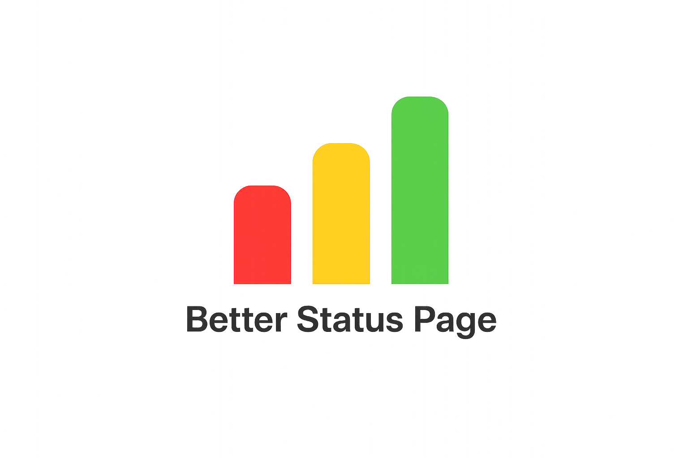

<div align="center">

[English](README.md) · **Polski**

<picture>
  <source media="(prefers-color-scheme: dark)" srcset="apps/status/public/logo_dark.png">
  <source media="(prefers-color-scheme: light)" srcset="apps/status/public/logo_light.png">
  
</picture>

<br />

**Samodzielnie hostowana strona statusu, przy której nie chce się płakać. 🟢**

*Monitoruj swoje usługi. Powiadamiaj zespół. Informuj użytkowników na bieżąco.*
*Bez chmury. Bez abonamentu. Bez dramy.*

[](https://nodejs.org)
[](https://typescriptlang.org)
[](https://react.dev)
[](https://fastify.dev)
[](LICENSE)

</div>

---

## W skrócie 🎤

Znasz to. API pada o 3 w nocy, użytkownicy zaczynają pisać na Twitterze, szef dzwoni, a Twoja strona statusu to... statyczny plik HTML, który ktoś ostatnio aktualizował w 2019 roku i który Comic Sansem głosi „Wszystkie systemy działają".

**BetterStatusPage** to naprawia. To w pełni samodzielnie hostowana platforma do monitoringu i stron statusu, działająca jako **pojedynczy proces Node.js bez żadnych zewnętrznych zależności** — bez Postgresa, bez Redisa, bez Kubernetesa, bez rachunku za SaaS na 200 dolarów miesięcznie. Sklonuj, skonfiguruj, wdróż. Gotowe.

---

## Status wydania

BetterStatusPage jest obecnie w fazie MVP. Aktualnym celem jest praktyczne, samodzielnie hostowane wdrożenie dla małych zespołów i prywatnej infrastruktury:

- jeden proces Node.js 26,
- przechowywanie danych w SQLite,
- wdrożenie przez Docker Compose,
- reverse proxy Nginx,
- wbudowane kopie zapasowe i przywracanie offline,
- brak wymaganej zewnętrznej bazy danych, kolejki czy cache.

Z góry dziękuję za zainteresowanie projektem oraz za każdą instalację, test, zgłoszenie błędu i opinię. Wczesne testy w realnych warunkach są szczególnie cenne i bezpośrednio pomogą ukształtować BetterStatusPage po etapie MVP.

Zanim wystawisz instancję produkcyjną, przeczytaj:

- [Przewodnik wdrożeniowy](docs/deployment.md) *(EN)*
- [Przewodnik po kopiach zapasowych i przywracaniu](docs/backup-restore.md) *(EN)*
- [Przewodnik po higienie alertów](docs/alert-hygiene.md) *(EN)*
- [Polityka bezpieczeństwa](SECURITY.md) *(EN)*

---

## Co potrafi 🚀

### 🔍 Pięć sposobów monitorowania

| Typ | Co sprawdza |
|------|---------------|
| **HTTPS** | Adresy URL, kody statusu, czasy odpowiedzi, słowa kluczowe w treści oraz pełne przepływy uwierzytelniania (Basic, OAuth2, CAS) |
| **Ping / TCP** | Czy host żyje — przez ICMP lub sprawdzenie portu TCP |
| **DNS** | Czy rekordy rozwiązują się poprawnie — A, AAAA, MX, CNAME, TXT, z obsługą własnego resolvera |
| **SQL Server** | Wykonuje zapytanie testowe na MSSQL i weryfikuje wynik |
| **Webhook** *(pasywny)* | Pozwala zewnętrznym usługom pingować *Ciebie*, by zasygnalizować, że żyją — cisza oznacza kłopoty |

Każdy monitor ma: konfigurowalne interwały, timeouty, ponowienia, **kolorowe tagi** do grupowania i **30-dniową historię dostępności**. A, i jest wbudowany tester, więc możesz sprawdzić konfigurację, zanim klikniesz Zapisz i natychmiast tego pożałujesz.

### 🔔 Powiadomienia, które faktycznie docierają do ludzi

Gdy coś się psuje (albo wraca do życia), BetterStatusPage może na Ciebie nakrzyczeć przez:

- **E-mail** — SMTP z TLS, własnym nadawcą i zmiennymi w szablonach
- **Webhook** — strzelaj do Slacka, PagerDuty lub dosłownie czegokolwiek z endpointem HTTP
- **Discord** — natywna integracja z rozbudowanymi embedami; kolory zależne od wagi (czerwony = awaria, pomarańczowy = degradacja, zielony = przywrócenie), bez tokena bota — wystarczy URL webhooka
- **Microsoft Teams** — natywna integracja MessageCard; kolorowe karty, bez instalowania aplikacji — wystarczy URL incoming webhooka
- **Slack** — natywna integracja Block Kit; kolorowe załączniki, opcjonalne wzmianki `<!here>` / `<!channel>` — wystarczy URL incoming webhooka

Wszystkie kanały obsługują zmienne szablonów, takie jak `{{monitor_name}}`, `{{status}}`, `{{error_message}}` itd., dzięki czemu alert może brzmieć *„API Gateway nie działa: przekroczono czas połączenia"* zamiast *„zmiana statusu"*.

Powiadomienia o przywróceniu są opcjonalne dla każdego kanału — bo czasem chcesz wiedzieć, kiedy wszystko wróciło, a czasem po prostu chcesz się wyspać.

Każda wysyłka jest zapisywana wraz z poszczególnymi próbami. Nieudane wysyłki są automatycznie ponawiane po 1 i 5 minutach, a potem pozostają widoczne w historii dostarczeń w panelu admina do ręcznego ponowienia. Historia dostarczeń jest przechowywana przez 180 dni.

> Zobacz **[docs/discord-integration.md](docs/discord-integration.md)** — konfiguracja Discorda krok po kroku *(EN)*.
> Zobacz **[docs/teams-integration.md](docs/teams-integration.md)** — konfiguracja Microsoft Teams krok po kroku *(EN)*.
> Zobacz **[docs/slack-integration.md](docs/slack-integration.md)** — konfiguracja Slacka krok po kroku *(EN)*.

### 🤫 Higiena alertów — powód, dla którego ludzie nie wyłączają powiadomień

System alertów, który musisz wyciszyć, jest gorszy niż brak systemu alertów. Cztery mechanizmy, wszystkie **domyślnie wyłączone**, więc nic się nie zmienia, dopóki o to nie poprosisz:

- **Progi awarii / przywrócenia** — per monitor. Alert dopiero po N kolejnych nieudanych sprawdzeniach. Jeden migoczący endpoint przestaje Cię budzić co minutę, a publiczna strona statusu i tak aktualizuje się natychmiast.
- **Godziny ciszy** — per kanał, z prawdziwą strefą czasową IANA. Powiadomienia są wstrzymywane do końca okna albo odrzucane. „Wstrzymaj" to rozsądna wartość domyślna: śpisz, nic nie ginie.
- **Limit częstotliwości** — per kanał: *nie więcej niż X alertów z tego monitora na godzinę*. Przywrócenia nigdy nie są limitowane, więc sygnał „wszystko OK" zawsze dociera.
- **Grupowanie** — per kanał: jeśli w tym samym oknie padnie wystarczająco wiele różnych monitorów, dostajesz **jedno** podsumowanie zamiast dwudziestu wiadomości. Okna, które nie stały się lawiną, są wysyłane pojedynczo, więc samotny alert nigdy nie zostaje połknięty.

Wszystko, co zatrzymają reguły, i tak trafia do historii dostarczeń wraz z powodem — możesz więc sprawdzić, co *nie* zostało wysłane, i poluzować regułę, jeśli była zbyt restrykcyjna.

> Zobacz **[docs/alert-hygiene.md](docs/alert-hygiene.md)** — jak reguły się łączą, jak dobrać wartości i jak wygląda API *(EN)*.

### 🔐 Sejf na Twoje sekrety

Trzymanie haseł w zmiennych środowiskowych jest w porządku — do czasu. BetterStatusPage ma wbudowany **sejf szyfrowany AES-256-GCM**, w którym możesz przechowywać dane uwierzytelniające i odwoływać się do nich w monitorach i ustawieniach SMTP. Obsługiwane typy:

- **userpass** — klasyczna nazwa użytkownika + hasło
- **value** — pojedynczy sekret (token API, connection string)
- **json** — pełny obiekt JSON z **mapowaniem pól**, by wybrać dokładnie te klucze, których potrzebujesz

Twoje sekrety nigdy nie pojawiają się w logach, odpowiedziach API ani w `git diff`.

### 🎨 Kreator stron metodą przeciągnij i upuść

Publiczna strona statusu to nie tylko lista zielonych kropek. To w pełni konfigurowalny układ siatki, który projektujesz samodzielnie — przeciągnij karty monitorów, pogrupuj je według usług, dodaj bloki tekstu w markdownie, wrzuć kanał incydentów, zmień rozmiary, gotowe. Bez CSS.

### 📢 Zarządzanie incydentami

Twórz incydenty, ustawiaj wagę (none → minor → major → critical), powiązuj dotknięte monitory, publikuj aktualizacje w czasie rzeczywistym w miarę rozwoju sytuacji i oznaczaj jako rozwiązane, gdy kurz opadnie. Na stronie publicznej aktywny incydent typu minor oznacza powiązane monitory jako zdegradowane, a incydenty major i critical — jako niedziałające. Rozwiązanie incydentu przywraca status raportowany przez sprawdzenia monitoringu.

### 🔧 Okna serwisowe

Masz zaplanowaną migrację bazy na 3 w nocy? Daj ludziom znać wcześniej, zamiast pozwolić im myśleć, że wszystko płonie.

Okna serwisowe wyciszają szum alertów na czas planowanej niedostępności — koniec z budzeniem dyżurnych z powodu prac, które robisz celowo. Utwórz okno z nazwą, opisem, czasem rozpoczęcia i zakończenia, i opcjonalnie ogranicz je do wybranych monitorów (albo przełącz na „wszystkie monitory"). Gdy okno jest aktywne:

- Kanały powiadomień milczą dla objętych monitorów — zmiany statusu są nadal śledzone, tylko nikt o nich nie krzyczy
- Publiczna strona statusu wyświetla bursztynowy baner z nazwą okna i czasem zakończenia
- Karty poszczególnych monitorów pokazują znacznik **MAINTENANCE**, żeby odwiedzający wiedzieli, co się dzieje
- Panel admina dzieli okna na **Aktywne / Nadchodzące / Minione**, więc zawsze wiesz, co jest zaplanowane

### 🕵️ Dziennik audytu

Za pół roku ktoś zapyta: *„kto w zeszły czwartek zmienił interwał sprawdzania monitora płatności z 30 sekund na 5 minut?"* Odpowiedź jest w dzienniku audytu.

Każda zmiana w panelu admina jest rejestrowana — kto, kiedy i co dokładnie zmienił. Przy aktualizacjach dostajesz różnice na poziomie pól z wartościami przed i po (wrażliwe pola, takie jak hasła, są zawsze ukrywane). Objęte encje:

| Co | Śledzone operacje |
|------|--------------------|
| Monitory | Tworzenie, aktualizacja (nazwa, typ, interwał, timeout, ponowienia, tagi, konfiguracja), usuwanie |
| Incydenty | Tworzenie, aktualizacja (tytuł, status, wpływ), usuwanie |
| Okna serwisowe | Tworzenie, aktualizacja, usuwanie |
| Kanały powiadomień | Tworzenie, aktualizacja (nazwa, typ, włączony, konfiguracja), usuwanie |
| Ustawienia SMTP | Konfiguracja / aktualizacja |
| Sejfy i sekrety | Tworzenie, aktualizacja (nazwa, zmiana wartości oznaczona jako `[redacted]`), usuwanie |
| Użytkownicy | Tworzenie, zmiana roli, reset hasła, usuwanie |
| Bezpieczeństwo konta | Włączenie lub wyłączenie uwierzytelniania dwuskładnikowego TOTP |

Strona dziennika audytu (tylko dla adminów) pozwala filtrować po **użytkowniku**, **typie encji**, **akcji** (create / update / delete) i **zakresie dat**. Kliknij dowolny wiersz, by rozwinąć różnice.

### 🌍 i18n, branding i cała reszta

- **Obsługa wielu języków** — dodaj własną lokalizację, przetłumacz każdy tekst, ustaw domyślny
- **Pełny branding** — nazwa strony, logo, favicon, 13 kolorów motywu i pole na własny CSS, gdy naprawdę chcesz poszaleć
- **Tryb ciemny** — bo dziś to obowiązek, a nie opcja

### 🔗 Zależności między monitorami

Nie każda awaria jest tym, na co wygląda. Gdy API pada, bo padła baza danych, nie chcesz trzech alertów — chcesz jeden, dotyczący faktycznej przyczyny.

BetterStatusPage pozwala zadeklarować, że **monitor A zależy od monitora B**. Gdy B pada, A automatycznie pokazuje **Dependency Issue** zamiast Down — a jego alert jest wyciszany, bo B już go wysłał. Gdy B wróci, A odzyskuje normalny status przy następnym sprawdzeniu.

Na publicznej stronie statusu dotknięte monitory wyświetlają znacznik **„Caused by: Database"**, dzięki czemu odwiedzający od razu rozumieją hierarchię, zamiast oglądać ścianę czerwonych kropek.

Konfiguracja per monitor w panelu admina → edycja monitora → zakładka **Depends on**.

### ⚡ Czas rzeczywisty, bez odświeżania

Zmiany statusu docierają zarówno do panelu admina, jak i do strony publicznej natychmiast, przez **Server-Sent Events**. W chwili, gdy monitor zmieni się z 🟢 na 🔴, wszyscy to widzą. Bez odpytywania, bez odświeżania strony, bez „czekaj, czy to aktualne?".

---

## Architektura 🏗️

```
┌─────────────────────────────────────────────────────────────┐
│                        Browser                              │
│                                                             │
│   ┌──────────────────┐        ┌──────────────────────────┐  │
│   │   Admin UI       │        │   Public Status Page     │  │
│   │   React 19       │        │   React 19               │  │
│   │   Vite · RQ · DnD│        │   SSE · i18n · dark mode │  │
│   └────────┬─────────┘        └────────────┬─────────────┘  │
└────────────┼──────────────────────────────┼────────────────┘
             │  REST + SSE                   │  REST + SSE
┌────────────▼──────────────────────────────▼────────────────┐
│                    Fastify 5  (Node.js 26+)                 │
│                                                             │
│   ┌──────────────┐  ┌──────────────┐  ┌──────────────────┐  │
│   │  Admin API   │  │  Public API  │  │  Webhook API     │  │
│   │ Session+RBAC │  │  open        │  │  token auth      │  │
│   └──────────────┘  └──────────────┘  └──────────────────┘  │
│                                                             │
│   ┌──────────────────────────────────────────────────────┐  │
│   │               Background Workers                     │  │
│   │                                                      │  │
│   │  Scheduler                  Notifier
│   │  ├── HTTPS checker          Vault resolver           │  │
│   │  ├── Ping / TCP             Result purger (daily)    │  │
│   │  ├── DNS resolver                                    │  │
│   │  └── SQL Server checker                              │  │
│   └──────────────────────────────────────────────────────┘  │
│                                                             │
│   ┌──────────────────────────────────────────────────────┐  │
│   │           Drizzle ORM  ·  SQLite (WAL mode)          │  │
│   └──────────────────────────────────────────────────────┘  │
└─────────────────────────────────────────────────────────────┘
```

### Dlaczego takie wybory?

**SQLite zamiast Postgresa** — Strona statusu dla większości zespołów nie potrzebuje serwera bazy danych. SQLite w trybie WAL bez wysiłku obsługuje współbieżne odczyty i zapisy, nie wymaga żadnej administracji, a cała baza to jeden plik, który możesz zarchiwizować przez `cp`. Jeśli Twoja strona statusu urośnie do momentu, w którym SQLite stanie się wąskim gardłem, masz znacznie większe problemy (i pewnie dedykowany zespół ops).

**SSE zamiast WebSocketów** — Aktualizacje statusu płyną wyłącznie w kierunku serwer → klient. SSE radzi sobie z tym idealnie, używa zwykłego HTTP, działa przez proxy bez zmian w konfiguracji i sam się ponownie łączy. Po co strzelać z armaty do wróbla?

**Monorepo z `@bsp/shared`** — API i oba frontendy współdzielą jeden pakiet TypeScript ze wszystkimi typami domenowymi. Zmieniasz typ w jednym miejscu, a kompilator krzyczy wszędzie tam, gdzie to ma znaczenie. Żadnych post-mortemów w stylu „zapomnieliśmy zaktualizować typy na froncie".

**Sejf AES-256-GCM w procesie** — Losowy 12-bajtowy IV dla każdego sekretu, weryfikacja tagu uwierzytelniającego przy odszyfrowaniu, sekrety nigdy nie trafiają do logów. To nie zamiennik HashiCorp Vault dla 500-osobowego działu inżynierii, ale wszystko, czego potrzebują zespoły chcące mieć szyfrowane sekrety bez stawiania kolejnej usługi.

---

## Stos technologiczny 🛠️

| Warstwa | Technologia | Wersja |
|-------|-----------|---------|
| Środowisko uruchomieniowe | Node.js | 26+ |
| Język | TypeScript | 5.7 |
| Backend | Fastify | 5.x |
| Baza danych | SQLite (`node:sqlite`) | wbudowana |
| ORM | Drizzle | 0.40 |
| Frontend | React | 19 |
| Budowanie | Vite | 6.x |
| Style | Tailwind CSS | 3.x |
| Pobieranie danych | TanStack Query | 5.x |
| Stan | Zustand | 5.x |
| Przeciągnij i upuść | dnd-kit | 6.x |
| Uwierzytelnianie | Sesje po stronie serwera, ciasteczka HttpOnly JWT, CSRF, TOTP, bcrypt | — |
| E-mail | Nodemailer | 8.x |
| SQL Server | mssql | 11.x |
| Harmonogram | node-cron | 3.x |

---

## Szybki start produkcyjny

Zalecaną ścieżką wdrożenia jest Docker Compose:

```bash
git clone https://github.com/BElluu/BetterStatusPage.git
cd BetterStatusPage
cp .env.example .env
```

Edytuj `.env` i ustaw co najmniej:

```env
NODE_ENV=production
JWT_SECRET=<losowy sekret, min. 32 znaki>
VAULT_ENCRYPTION_KEY=<64-znakowy klucz hex>
```

Wygeneruj bezpieczne wartości:

```bash
node -e "console.log(require('crypto').randomBytes(32).toString('hex'))"
```

Uruchom aplikację:

```bash
export BSP_IMAGE=ghcr.io/belluu/better-status-page:0.1.4
docker compose up -d
```

Otwórz `http://your-server:3000/admin`, by przejść konfigurację początkową. Przy wdrożeniach wystawionych do internetu postaw przed aplikacją Nginx/SSL i nie wystawiaj publicznie portu aplikacji. Zobacz [docs/deployment.md](docs/deployment.md) *(EN)*.

---

## Pierwsze kroki dla deweloperów ⚡

### Będziesz potrzebować

- **Node.js 26.10+** — używamy wbudowanego modułu `node:sqlite`, więc żadnych prehistorycznych środowisk
- **npm 11+**

### Instalacja

```bash
git clone https://github.com/BElluu/BetterStatusPage.git
cd BetterStatusPage
npm install
```

### Tryb deweloperski

```bash
npm run dev
```

Uruchamiają się trzy rzeczy:

| Aplikacja | URL |
|-----|-----|
| API | `http://localhost:3000` |
| Panel admina | `http://localhost:5173` |
| Strona statusu | `http://localhost:5174` |

Otwórz adres panelu admina, a przywita Cię kreator konfiguracji. Utwórz konto administratora i gotowe.

### Kontrola jakości

```bash
npm run lint            # ESLint dla API, współdzielonych typów i obu aplikacji React
npm test                # testy integracyjne API + testy komponentów frontendu
npm run test:coverage   # raport pokrycia frontendu z wymuszonymi progami
npm run build           # ścisły TypeScript i buildy produkcyjne wszystkich workspace'ów
npm run backup          # spójna kopia zapasowa bazy danych + uploadów (po buildzie)
```

Testy dymne w przeglądarce korzystają z Playwrighta. Zainstaluj raz Chromium, a potem uruchom zestaw testów:

```bash
npx playwright install chromium
npm run test:e2e
```

Zestaw E2E przechowuje dane robocze w `.e2e/`. GitHub Actions uruchamia lint, testy, pokrycie, buildy, Playwright E2E i produkcyjny test dymny Dockera dla pull requestów i pushy do `main`.

### Produkcja

```bash
npm run build   # buduje API i oba frontendy
npm start       # uruchamia API, które serwuje je jako pliki statyczne
```

Jeden proces. Jeden port. I tyle.

---

## Konfiguracja ⚙️

Skopiuj `.env.example` do `.env`:

```env
PORT=3000
NODE_ENV=production
BSP_IMAGE=ghcr.io/belluu/better-status-page:0.1.4
BSP_BIND_ADDRESS=127.0.0.1

JWT_SECRET=something-long-random-and-secret
VAULT_ENCRYPTION_KEY=64-char-hex-string   # patrz niżej

DATABASE_PATH=./data/db.sqlite
UPLOAD_DIR=./data/uploads

# Lista dozwolonych originów dla CORS, rozdzielona przecinkami
ALLOWED_ORIGINS=https://status.example.com,https://admin.example.com

# Ustaw tylko wtedy, gdy port 3000 jest dostępny wyłącznie przez jedno zaufane reverse proxy
TRUST_PROXY=1

# Opcjonalne strojenie harmonogramu
SCHEDULER_TICK_SECONDS=10
MONITOR_CHECK_CONCURRENCY=20
MONITOR_RESULT_RETENTION_DAYS=90
MONITOR_RESULT_PURGE_CRON=0 2 * * *
```

> 🔑 **Wygeneruj klucz szyfrowania sejfu:**
> ```bash
> node -e "console.log(require('crypto').randomBytes(32).toString('hex'))"
> ```
> Przechowuj go w bezpiecznym miejscu. Jeśli się zmieni, wszystkie zapisane sekrety staną się nieczytelne. Tak, wszystkie.

---

## Role użytkowników 👥

| Rola | Co może robić |
|------|-----------------|
| **admin** | Wszystko, łącznie z użytkownikami, sejfami, dziennikiem audytu i kopiami zapasowymi |
| **operator** | Monitory, incydenty, okna serwisowe, powiadomienia, kreator stron, branding, lokalizacja i ustawienia |
| **branding** | Kreator stron, branding, lokalizacja i ustawienia konta |

Sesje administratorów są przechowywane po stronie serwera i uwierzytelniane ciasteczkiem `HttpOnly`, `SameSite=Strict`. Żądania przeglądarki zmieniające stan wymagają pasującego tokena CSRF. Użytkownicy mogą włączyć uwierzytelnianie dwuskładnikowe TOTP w **Ustawieniach** i otrzymać osiem jednorazowych kodów odzyskiwania.

---

## Wdrożenie 📦

### Za Nginxem (zalecane)

```nginx
server {
    listen 443 ssl;
    server_name status.example.com;

    location / {
        proxy_pass http://localhost:3000;
        proxy_set_header Host $host;
        proxy_set_header X-Real-IP $remote_addr;
        proxy_set_header X-Forwarded-For $proxy_add_x_forwarded_for;

        # SSE tego wymaga — nie pomijaj
        proxy_buffering off;
        proxy_cache off;
        proxy_read_timeout 3600s;
    }
}
```

### Z PM2

```bash
npm i -g pm2
pm2 start npm --name "bsp" -- start
pm2 save && pm2 startup
```

### Z Docker Compose (zalecane)

```bash
cp .env.example .env   # uzupełnij JWT_SECRET i VAULT_ENCRYPTION_KEY
export BSP_IMAGE=ghcr.io/belluu/better-status-page:0.1.4
docker compose up -d
```

Dane (baza SQLite + uploady) są przechowywane w nazwanym wolumenie Dockera (`bsp_data`) i przetrwają przebudowę kontenera, restarty i aktualizacje obrazu. Zostaną usunięte tylko wtedy, gdy jawnie uruchomisz `docker compose down -v`.

Przy lokalnym rozwijaniu obrazu użyj lokalnego nadpisania, aby produkcyjny plik Compose nadal korzystał z GHCR:

```bash
docker compose -f docker-compose.yml -f docker-compose.local.yml up -d --build
```

Zobacz **[docs/deployment.md](docs/deployment.md)** — pełny przewodnik wdrożeniowy, w tym konfiguracja Nginx + SSL, instalacja bare-metal, PM2, kopie zapasowe i konfiguracja firewalla *(EN)*.

---

## Lista kontrolna przed produkcją

Zanim udostępnisz instancję publicznie:

- Ustaw `NODE_ENV=production`.
- Zastąp `JWT_SECRET` losową, niedomyślną wartością.
- Ustaw `VAULT_ENCRYPTION_KEY` na losową 64-znakową wartość hex i przechowuj ją poza aplikacją.
- Postaw aplikację za Nginx/SSL i nie wystawiaj bezpośrednio portu 3000.
- Ustaw `TRUST_PROXY=1` tylko wtedy, gdy aplikacja jest dostępna wyłącznie przez Twoje reverse proxy.
- Utwórz kopię zapasową i ją zweryfikuj.
- Wykonaj testowe przywrócenie na nieprodukcyjnej kopii.
- Upewnij się, że kontrole wydania są zielone: lint, testy, build, build Dockera i E2E na linuksowym CI.
- Przejrzyj [SECURITY.md](SECURITY.md), zanim otworzysz publiczne zgłaszanie problemów.

---

## Struktura projektu 📁

```
BetterStatusPage/
├── apps/
│   ├── api/           # Backend Fastify
│   │   └── src/
│   │       ├── db/        # Schemat, migracje, seed
│   │       ├── routes/    # Obsługa endpointów
│   │       ├── workers/   # Harmonogram, checkery, notifier
│   │       ├── crypto/    # Szyfrowanie sejfu AES-256-GCM
│   │       └── services/  # Nadawca SSE
│   ├── admin/         # Panel admina (React)
│   └── status/        # Publiczna strona statusu (React)
└── packages/
    └── shared/        # Współdzielone typy TypeScript (@bsp/shared)
```

---

## Plan rozwoju 🗺️

BetterStatusPage świetnie działa jako pojedynczy proces oparty na SQLite — ale wiemy, że nie każdemu to wystarcza. Oto dokąd zmierzamy:

### 🗄️ Więcej backendów bazodanowych

SQLite jest idealny na start, ale jeśli BetterStatusPage działa u Ciebie jako część większej infrastruktury, w której dane już żyją w zarządzanej bazie, nie ma powodu iść na kompromisy. Dodajemy natywną obsługę:

- **PostgreSQL** — dla zespołów, które już używają Postgresa, lub dla każdego, kto chce odtwarzania do punktu w czasie, replik do odczytu i prawdziwie współbieżnych zapisów
- **MariaDB / MySQL** — ten sam pomysł, inny smak

Celem jest pojedynczy przełącznik konfiguracyjny `DATABASE_URL`. Bez zmian w kodzie, bez bólu głowy z migracją danych — po prostu wskaż istniejącą bazę i działaj.

### 🔐 Integracja z Azure Key Vault

Wbudowany sejf świetnie sprawdza się w samodzielnych wdrożeniach, ale firmy zwykle trzymają już sekrety gdzie indziej — najczęściej w Azure Key Vault. Zamiast duplikować dane uwierzytelniające, chcemy, by BetterStatusPage pobierał je bezpośrednio z AKV w czasie działania. Konkretnie:

- Uwierzytelnianie przez managed identity lub service principal
- Odwoływanie się do sekretów z Azure Key Vault po nazwie w konfiguracji monitorów i SMTP
- Zero sekretów przechowywanych lokalnie — aplikacja jest tylko konsumentem

Jeśli korzystasz z AWS lub GCP, obserwuj projekt — naturalnym rozszerzeniem będą AWS Secrets Manager i GCP Secret Manager.

### 🔔 Więcej kanałów powiadomień

E-mail, webhook, Discord, Teams i Slack pokrywają najczęstsze przypadki, ale alerty są tylko tak dobre, jak kanały, które ludzie faktycznie obserwują. Wciąż na liście:

- **Telegram** — dla zespołów, które tam żyją
- **SMS** — przez Twilio lub podobne, na wypadek gdy płonie sam internet i nikt nie zagląda na Slacka
- **PagerDuty / OpsGenie** — gdy „ktoś powinien na to zerknąć" musi zamienić się w „obudźcie kogoś natychmiast"

### 📡 Więcej typów monitorów

Pięć typów monitorów pokrywa większość przypadków, ale zawsze jest coś więcej do ogarnięcia:

- **gRPC** — health checki dla usług, które nie mówią po HTTP
- **Redis / Valkey** — `PING` i sprawdzanie obecności kluczy w warstwie cache
- **Playwright / Puppeteer** — pełny syntetyczny monitoring w przeglądarce dla przepływów wymagających renderowania JavaScriptu (logowanie, ścieżki zakupowe, SPA)
- **Wygasanie certyfikatów TLS/SSL** — wyłap przeterminowane certyfikaty, zanim zrobią to użytkownicy
- **Kafka / RabbitMQ** — łączność z brokerem i monitoring opóźnień
- **Własne skryptowe sprawdzenia** — uruchom dowolny fragment Node.js, zwróć status — pełna elastyczność dla wszystkiego, co nie pasuje do predefiniowanego typu

---

> 💡 Masz pomysł na funkcję, którego nie ma na liście? Otwórz issue — najlepsze pozycje w planie rozwoju pochodzą od ludzi, którzy faktycznie używają tego na produkcji.

---

## Współtworzenie 🤝

Trafił Ci się błąd? Masz pomysł? PR-y są mile widziane — tylko przy czymkolwiek większym niż poprawka literówki najpierw otwórz issue, żebyśmy mogli omówić podejście.

1. Zrób forka
2. `git checkout -b feature/your-idea`
3. Zbuduj coś fajnego
4. Uruchom `npm run lint && npm test && npm run build`
5. Otwórz PR

---

## Licencja

MIT — rób, co chcesz. Tylko błagamy, nie ustawiaj na stronie statusu Comic Sansa. 😅

---

## ☕ Wsparcie

BetterStatusPage jest całkowicie darmowy i open source. Jeśli uważasz go za przydatny i chcesz wesprzeć dalszy rozwój, dobrowolne darowizny są mile widziane, ale nigdy nie są wymagane!

[](https://buymeacoffee.com/belluu)

Twoje wsparcie pomaga utrzymać projekt przy życiu i motywuje do dalszej pracy — ale samo używanie BetterStatusPage, testowanie go i dzielenie się opiniami to już wystarczające wsparcie!

---

<div align="center">
  <sub>Napędzane kawą ☕, lekkim niewyspaniem i szczerą nienawiścią do kłamiących stron statusu.</sub>
</div>
