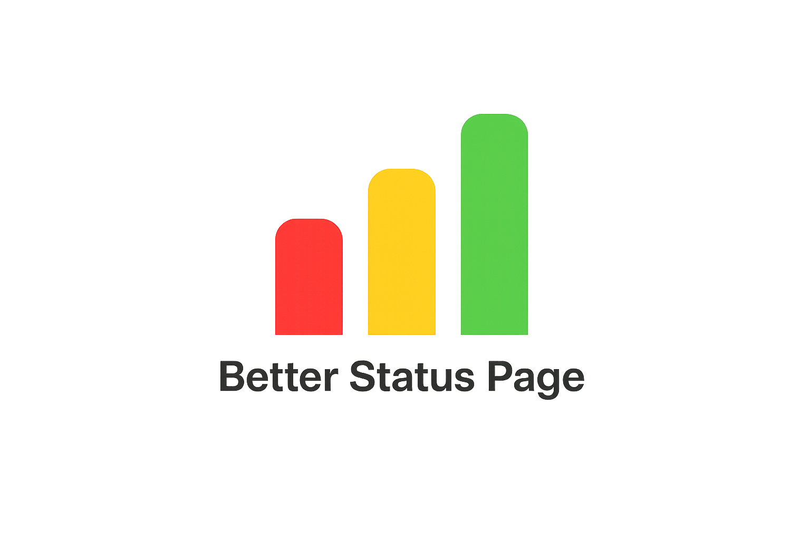

<div align="center">

[English](README.md) · **Polski**

<picture>
  <source media="(prefers-color-scheme: dark)" srcset="apps/status/public/logo_dark.png">
  <source media="(prefers-color-scheme: light)" srcset="apps/status/public/logo_light.png">
  
</picture>

<br />

**Samodzielnie hostowana strona statusu, przy której nie chce się płakać. 🟢**

*Monitoruj swoje usługi. Powiadamiaj zespół. Informuj użytkowników na bieżąco.*
*Bez chmury. Bez abonamentu. Bez dramy.*

**[🌐 Strona projektu](https://betterstatuspage.dev)** · **[🚀 Demo na żywo](https://demo.betterstatuspage.dev/)** · **[📖 Dokumentacja](https://docs.betterstatuspage.dev)**

[](https://nodejs.org)
[](https://typescriptlang.org)
[](https://react.dev)
[](https://fastify.dev)
[](LICENSE)

</div>

---

## W skrócie 🎤

Znasz to. API pada o 3 w nocy, użytkownicy zaczynają pisać na Twitterze, szef dzwoni, a Twoja strona statusu to... statyczny plik HTML, który ktoś ostatnio aktualizował w 2019 roku i który Comic Sansem głosi „Wszystkie systemy działają".

**BetterStatusPage** to naprawia. To w pełni samodzielnie hostowana platforma do monitoringu i stron statusu, działająca jako **pojedynczy proces Node.js bez żadnych zewnętrznych zależności** — bez Postgresa, bez Redisa, bez Kubernetesa, bez rachunku za SaaS na 200 dolarów miesięcznie. Sklonuj, skonfiguruj, wdróż. Gotowe.

---

## Status wydania

BetterStatusPage jest obecnie w fazie MVP. Aktualnym celem jest praktyczne, samodzielnie hostowane wdrożenie dla małych zespołów i prywatnej infrastruktury:

- jeden proces Node.js 26,
- przechowywanie danych w SQLite,
- wdrożenie przez Docker Compose,
- reverse proxy Nginx,
- wbudowane kopie zapasowe i przywracanie offline,
- brak wymaganej zewnętrznej bazy danych, kolejki czy cache.

Z góry dziękuję za zainteresowanie projektem oraz za każdą instalację, test, zgłoszenie błędu i opinię. Wczesne testy w realnych warunkach są szczególnie cenne i bezpośrednio pomogą ukształtować BetterStatusPage po etapie MVP.

Pełna dokumentacja (EN): **https://docs.betterstatuspage.dev**. Zanim wystawisz instancję produkcyjną, przeczytaj:

- [Przewodnik wdrożeniowy](https://docs.betterstatuspage.dev/deployment/) *(EN)*
- [Przewodnik po kopiach zapasowych i przywracaniu](https://docs.betterstatuspage.dev/backup-restore/) *(EN)*
- [Przewodnik po higienie alertów](https://docs.betterstatuspage.dev/alert-hygiene/) *(EN)*
- [Przewodnik po subskrypcjach strony statusu](https://docs.betterstatuspage.dev/subscriptions/) *(EN)*
- [Przewodnik po prywatnej stronie statusu](https://docs.betterstatuspage.dev/private-status-page/) *(EN)*
- [Przewodnik po użytkownikach i rolach](https://docs.betterstatuspage.dev/users-and-roles/) *(EN)*
- [Polityka bezpieczeństwa](https://github.com/BElluu/BetterStatusPage/security/policy) *(EN)*

---

## Co potrafi 🚀

### 🔍 Pięć sposobów monitorowania

| Typ | Co sprawdza |
|------|---------------|
| **HTTPS** | Adresy URL, kody statusu, czasy odpowiedzi, słowa kluczowe w treści, pełne przepływy uwierzytelniania (Basic, OAuth2, CAS) oraz opcjonalne ostrzeżenia o wygasającym certyfikacie TLS |
| **Ping / TCP** | Czy host żyje — przez ICMP lub sprawdzenie portu TCP |
| **DNS** | Czy rekordy rozwiązują się poprawnie — A, AAAA, MX, CNAME, TXT, z obsługą własnego resolvera |
| **SQL Server** | Wykonuje zapytanie testowe na MSSQL i weryfikuje wynik |
| **PostgreSQL** | Wykonuje zapytanie testowe na PostgreSQL i weryfikuje wynik |
| **MySQL / MariaDB** | Wykonuje zapytanie testowe na MySQL lub MariaDB i weryfikuje wynik |
| **MongoDB** | Wykonuje komendę testową na MongoDB i weryfikuje wynik |
| **Webhook** *(pasywny)* | Pozwala zewnętrznym usługom pingować *Ciebie*, by zasygnalizować, że żyją — cisza oznacza kłopoty |

Każdy monitor ma: konfigurowalne interwały, timeouty, ponowienia, **kolorowe tagi** do grupowania **30-dniowy pasek dostępności** na stronie statusu, a wyniki sprawdzeń są domyślnie przechowywane przez 90 dni, a osobna strona monitora w panelu pokazuje dostępność, percentyle czasu odpowiedzi, incydenty i ostatnie błędy. A, i jest wbudowany tester, więc możesz sprawdzić konfigurację, zanim klikniesz Zapisz i natychmiast tego pożałujesz.

> Zobacz **[docs.betterstatuspage.dev/monitors](https://docs.betterstatuspage.dev/monitors/)** — wszystkie typy monitorów, uwierzytelnianie, adresy heartbeat, ostrzeżenia o certyfikatach i zależności *(EN)*.

### 🔔 Powiadomienia, które faktycznie docierają do ludzi

Gdy coś się psuje (albo wraca do życia), BetterStatusPage może na Ciebie nakrzyczeć przez:

- **E-mail** — SMTP z TLS, własnym nadawcą i zmiennymi w szablonach
- **Webhook** — strzelaj do Slacka, PagerDuty lub dosłownie czegokolwiek z endpointem HTTP
- **Discord** — natywna integracja z rozbudowanymi embedami; kolory zależne od wagi (czerwony = awaria, pomarańczowy = degradacja, zielony = przywrócenie), bez tokena bota — wystarczy URL webhooka
- **Microsoft Teams** — natywna integracja MessageCard; kolorowe karty, bez instalowania aplikacji — wystarczy URL incoming webhooka
- **Slack** — natywna integracja Block Kit; kolorowe załączniki, opcjonalne wzmianki `<!here>` / `<!channel>` — wystarczy URL incoming webhooka
- **Telegram** — wiadomości przez własnego bota z emoji wagi (🔴 / 🟡 / 🟢) — wystarczy token bota i ID czatu

Wszystkie kanały obsługują zmienne szablonów, takie jak `{{monitor_name}}`, `{{status}}`, `{{error_message}}` itd., dzięki czemu alert może brzmieć *„API Gateway nie działa: przekroczono czas połączenia"* zamiast *„zmiana statusu"*.

Powiadomienia o przywróceniu są opcjonalne dla każdego kanału — bo czasem chcesz wiedzieć, kiedy wszystko wróciło, a czasem po prostu chcesz się wyspać.

**Ostrzeżenia o wygasającym certyfikacie TLS** — włączasz je dla wybranego monitora HTTPS i ustawiasz, ile dni wcześniej mają przyjść (domyślnie 14). Kanały monitora dostają jedno ostrzeżenie, gdy certyfikat wejdzie w to okno, potem przypomnienia 7, 3 i 1 dzień przed wygaśnięciem, a po odnowieniu — potwierdzenie (jeśli kanał wysyła powiadomienia o przywróceniu). Certyfikat jest odczytywany co 6 godzin; publiczna strona statusu się nie zmienia, a certyfikat, który już wygasł, i tak kończy się błędem sprawdzenia i alertem „down”. Lista monitorów w panelu admina pokazuje, ile dni zostało każdemu certyfikatowi, a tester — datę wygaśnięcia. Powiadomienia o certyfikatach dodają zmienne szablonów `{{event_type}}` (`certificate`), `{{cert_expires_in}}`, `{{cert_expires_at}}`, `{{cert_days_left}}` i `{{cert_host}}`; `{{status}}` przyjmuje wartość `cert-expiring` lub `cert-renewed`.

Każda wysyłka jest zapisywana wraz z poszczególnymi próbami. Nieudane wysyłki są automatycznie ponawiane po 1 i 5 minutach, a potem pozostają widoczne w historii dostarczeń w panelu admina do ręcznego ponowienia. Historia dostarczeń jest przechowywana przez 180 dni.

> Zobacz **[docs.betterstatuspage.dev/notification-channels](https://docs.betterstatuspage.dev/notification-channels/)** — email, webhook, zmienne szablonu i ponawianie dostarczeń *(EN)*.
> Zobacz **[docs.betterstatuspage.dev/discord-integration](https://docs.betterstatuspage.dev/discord-integration/)** — konfiguracja Discorda krok po kroku *(EN)*.
> Zobacz **[docs.betterstatuspage.dev/teams-integration](https://docs.betterstatuspage.dev/teams-integration/)** — konfiguracja Microsoft Teams krok po kroku *(EN)*.
> Zobacz **[docs.betterstatuspage.dev/slack-integration](https://docs.betterstatuspage.dev/slack-integration/)** — konfiguracja Slacka krok po kroku *(EN)*.
> Zobacz **[docs.betterstatuspage.dev/telegram-integration](https://docs.betterstatuspage.dev/telegram-integration/)** — konfiguracja Telegrama krok po kroku *(EN)*.

### 🤫 Higiena alertów — powód, dla którego ludzie nie wyłączają powiadomień

System alertów, który musisz wyciszyć, jest gorszy niż brak systemu alertów. Cztery mechanizmy, wszystkie **domyślnie wyłączone**, więc nic się nie zmienia, dopóki o to nie poprosisz:

- **Progi awarii / przywrócenia** — per monitor. Alert dopiero po N kolejnych nieudanych sprawdzeniach. Jeden migoczący endpoint przestaje Cię budzić co minutę, a publiczna strona statusu i tak aktualizuje się natychmiast.
- **Godziny ciszy** — per kanał, z prawdziwą strefą czasową IANA. Powiadomienia są wstrzymywane do końca okna albo odrzucane. „Wstrzymaj" to rozsądna wartość domyślna: śpisz, nic nie ginie.
- **Limit częstotliwości** — per kanał: *nie więcej niż X alertów z tego monitora na godzinę*. Przywrócenia nigdy nie są limitowane, więc sygnał „wszystko OK" zawsze dociera.
- **Grupowanie** — per kanał: jeśli w tym samym oknie padnie wystarczająco wiele różnych monitorów, dostajesz **jedno** podsumowanie zamiast dwudziestu wiadomości. Okna, które nie stały się lawiną, są wysyłane pojedynczo, więc samotny alert nigdy nie zostaje połknięty.

Wszystko, co zatrzymają reguły, i tak trafia do historii dostarczeń wraz z powodem — możesz więc sprawdzić, co *nie* zostało wysłane, i poluzować regułę, jeśli była zbyt restrykcyjna.

> Zobacz **[docs.betterstatuspage.dev/alert-hygiene](https://docs.betterstatuspage.dev/alert-hygiene/)** — jak reguły się łączą, jak dobrać wartości i jak wygląda API *(EN)*.

### 🔐 Sejf na Twoje sekrety

Trzymanie haseł w zmiennych środowiskowych jest w porządku — do czasu. BetterStatusPage ma wbudowany **sejf szyfrowany AES-256-GCM**, w którym możesz przechowywać dane uwierzytelniające i odwoływać się do nich w monitorach i ustawieniach SMTP. Obsługiwane typy:

- **userpass** — klasyczna nazwa użytkownika + hasło
- **value** — pojedynczy sekret (token API, connection string)
- **json** — pełny obiekt JSON z **mapowaniem pól**, by wybrać dokładnie te klucze, których potrzebujesz

Wolisz trzymać sekrety gdzie indziej? Sejf może też czytać je na żywo z **HashiCorp Vault** (KV v2, token lub AppRole) zamiast je przechowywać.

Twoje sekrety nigdy nie pojawiają się w logach, listach zwracanych przez API, dzienniku audytu ani w `git diff` — wartość widzi tylko administrator, który kliknie **Reveal**.

> Zobacz **[docs.betterstatuspage.dev/vault](https://docs.betterstatuspage.dev/vault/)** — typy sekretów, mapowanie pól i gdzie można ich używać *(EN)*.

### 🔑 Jednokrotne logowanie (SSO) przez OpenID Connect

Pozwól zespołowi logować się dostawcą tożsamości, którego już używa — **Microsoft Entra ID, Keycloak, Okta, Google Workspace, Authentik, Auth0** albo dowolnym innym dostawcą OIDC. Przepływ Authorization Code z PKCE, `state` i `nonce`, kończący się tą samą utwardzoną sesją po stronie serwera co logowanie hasłem.

- **Konfiguracja w interfejsie, od razu w mocy** — wejdź w **Użytkownicy → Single sign-on**, wklej issuera, client ID i sekret, kliknij **Test connection** i zapisz. Bez edycji `.env` i bez restartu. Sekret jest przechowywany zaszyfrowany i nigdy nie jest pokazywany ponownie.
- **Tylko istniejący użytkownicy** — użytkownicy są dopasowywani po zweryfikowanym adresie email i zachowują swoją rolę w BetterStatusPage, więc nikt nie wejdzie przypadkiem. Jedyne konta, jakie SSO może założyć, to konta Viewer dla prywatnej strony statusu, i tylko dla wskazanych domen email.
- **Logowanie hasłem zostaje jako zabezpieczenie** — albo wyłącz je, gdy SSO już działa. Da się je wyłączyć dopiero po udanym teście połączenia z dostawcą, a `OIDC_FORCE_PASSWORD_LOGIN=true` to przełącznik awaryjny na wypadek awarii dostawcy.
- **Przyjazne dla infrastruktury jako kod** — te same ustawienia mogą pochodzić ze zmiennych `OIDC_*`, które wtedy nadpisują formularz i go blokują.
- **Audytowane** — każde logowanie, udane czy odrzucone, i każda zmiana ustawień trafia do dziennika audytu (sekret nigdy).

> Zobacz **[docs.betterstatuspage.dev/single-sign-on](https://docs.betterstatuspage.dev/single-sign-on/)** — konfiguracja, uwagi o dostawcach i rozwiązywanie problemów *(EN)*.

### 🎨 Kreator stron metodą przeciągnij i upuść

Publiczna strona statusu to nie tylko lista zielonych kropek. To w pełni konfigurowalny układ siatki, który projektujesz samodzielnie — przeciągnij karty monitorów, pogrupuj je według usług (i przeciągaj je do grup i z grup), dodaj bloki tekstu w markdownie, wrzuć kanał incydentów, zmień rozmiary, gotowe. Bez CSS.

> Zobacz **[docs.betterstatuspage.dev/customizing-the-status-page](https://docs.betterstatuspage.dev/customizing-the-status-page/)** — bloki kreatora, branding, tryb ciemny i tłumaczenia *(EN)*.

### 📢 Zarządzanie incydentami

Twórz incydenty, ustawiaj wagę (minor → major → critical), powiązuj dotknięte monitory, publikuj aktualizacje w czasie rzeczywistym w miarę rozwoju sytuacji i oznaczaj jako rozwiązane, gdy kurz opadnie. Na stronie publicznej aktywny incydent typu minor oznacza powiązane monitory jako zdegradowane, a incydenty major i critical — jako niedziałające. Rozwiązanie incydentu przywraca status raportowany przez sprawdzenia monitoringu.

### 📬 Subskrypcje dla odbiorców

Kanały powiadomień budzą Twój zespół, a subskrypcje informują **Twoich użytkowników**. Odwiedzający zapisują się ze strony statusu przez e-mail lub webhook, dodają kanał do Slacka poleceniem `/feed subscribe`, śledzą kanał RSS/Atom albo odpytują publiczne API JSON (`summary.json`, `components.json`).

- **Ty decydujesz, co może być wysyłane** — wybierasz dostępne kanały i typy zdarzeń (nowe incydenty, aktualizacje, rozwiązania, planowane prace serwisowe). Subskrybenci wybierają spośród nich i mogą je zawęzić do interesujących ich komponentów lub tagów.
- **Double opt-in** przez e-mail, a w każdej wiadomości link do zarządzania subskrypcją i wypis jednym kliknięciem (RFC 8058)
- **Tylko to, co publikujesz** — incydenty i prace serwisowe, nigdy flapy monitorów. Pole *Notify subscribers* pozwala opublikować wpis po cichu.
- **Konfigurowalne webhooki** — subskrybent wybiera metodę HTTP i własne nagłówki, może dostać maila, gdy jego endpoint przestanie odpowiadać, a stale zawodzące endpointy są automatycznie wstrzymywane
- **Historia dostaw** — każde powiadomienie wysłane do subskrybentów z jego statusem i ostatnim błędem, ponawianie nieudanych oraz eksport listy subskrybentów do CSV
- **Bezpieczny publiczny formularz** — limit żądań, honeypot, brak możliwości sprawdzenia, kto jest zapisany, i adresy webhooków, które nigdy nie wskażą Twojej sieci wewnętrznej

> Zobacz **[docs.betterstatuspage.dev/subscriptions](https://docs.betterstatuspage.dev/subscriptions/)** — konfiguracja, zasady dostarczania i format webhooka *(EN)*.

### 🔒 Prywatne strony statusu

Nie każda strona statusu jest dla całego internetu. Włącz **Users → Status page access → Private status page**, a stronę zobaczą tylko zalogowani użytkownicy. Pozostali dostaną ekran logowania w brandingu Twojej strony, z logowaniem hasłem i przez SSO.

- **Rola Viewer** — dla osób, które mają tylko oglądać stronę; panel administracyjny jest dla nich zamknięty
- **Konta Viewer z SSO** — opcjonalnie każdy, kto zaloguje się przez Twojego dostawcę tożsamości ze zweryfikowanym adresem email z domeny z listy, dostaje konto Viewer przy pierwszej wizycie
- **Nic nie wycieka** — dane statusu, historia i strumień na żywo wymagają sesji; kanały RSS/Atom i JSON API statusu są wyłączone; odpowiedzi są oznaczone jako `private` i `noindex`

> Zobacz **[docs.betterstatuspage.dev/private-status-page](https://docs.betterstatuspage.dev/private-status-page/)** — kto może oglądać prywatną stronę i co jest wtedy wyłączone *(EN)*.

### 🔧 Okna serwisowe

Masz zaplanowaną migrację bazy na 3 w nocy? Daj ludziom znać wcześniej, zamiast pozwolić im myśleć, że wszystko płonie.

Okna serwisowe wyciszają szum alertów na czas planowanej niedostępności — koniec z budzeniem dyżurnych z powodu prac, które robisz celowo. Utwórz okno z nazwą, opisem, czasem rozpoczęcia i zakończenia, i opcjonalnie ogranicz je do wybranych monitorów (albo przełącz na „wszystkie monitory"). Gdy okno jest aktywne:

- Kanały powiadomień milczą dla objętych monitorów — zmiany statusu są nadal śledzone, tylko nikt o nich nie krzyczy
- Publiczna strona statusu wyświetla baner prac serwisowych z nazwą okna i czasem zakończenia
- Karty poszczególnych monitorów pokazują znacznik **MAINTENANCE**, żeby odwiedzający wiedzieli, co się dzieje
- Panel admina dzieli okna na **Aktywne / Nadchodzące / Minione**, więc zawsze wiesz, co jest zaplanowane

> Zobacz **[docs.betterstatuspage.dev/incidents-and-maintenance](https://docs.betterstatuspage.dev/incidents-and-maintenance/)** — statusy i wpływ incydentów oraz co dokładnie wycisza okno serwisowe *(EN)*.

### 🕵️ Dziennik audytu

Za pół roku ktoś zapyta: *„kto w zeszły czwartek zmienił interwał sprawdzania monitora płatności z 30 sekund na 5 minut?"* Odpowiedź jest w dzienniku audytu.

Każda zmiana w panelu admina jest rejestrowana — kto, kiedy i co dokładnie zmienił. Przy aktualizacjach dostajesz różnice na poziomie pól z wartościami przed i po (wrażliwe pola, takie jak hasła, są zawsze ukrywane). Objęte encje:

| Co | Śledzone operacje |
|------|--------------------|
| Monitory | Tworzenie, aktualizacja (nazwa, typ, interwał, timeout, ponowienia, tagi, konfiguracja), usuwanie |
| Incydenty | Tworzenie, aktualizacja (tytuł, status, wpływ), usuwanie |
| Okna serwisowe | Tworzenie, aktualizacja, usuwanie |
| Kanały powiadomień | Tworzenie, aktualizacja (nazwa, typ, włączony, konfiguracja), usuwanie |
| Ustawienia SMTP | Konfiguracja / aktualizacja |
| Ustawienia subskrypcji | Konfiguracja lub zmiana metod, typów powiadomień i zakresu komponentów |
| Subskrybenci | Usuwanie (pojedyncze lub kilku naraz) |
| Dostawy do subskrybentów | Ręczne ponowienie nieudanej dostawy |
| Sejfy i sekrety | Tworzenie, aktualizacja (nazwa, zmiana wartości oznaczona jako `[redacted]`), usuwanie |
| Użytkownicy | Tworzenie, zmiana roli, reset hasła, usuwanie |
| Tokeny API | Utworzenie lub unieważnienie (nigdy sam token) oraz każda zmiana wykonana tokenem, pod adresem email twórcy i nazwą tokena |
| Import | Każdy import z liczbami zmian oraz każdy monitor i kanał, który zmienił |
| Bezpieczeństwo konta | Włączenie lub wyłączenie uwierzytelniania dwuskładnikowego TOTP, zmiana hasła, powiązanie konta z SSO, unieważnienie hasła tymczasowego |
| Ustawienia SSO | Konfiguracja lub zmiana ustawień OpenID Connect |
| Branding, kreator strony, tłumaczenia | Zapis brandingu i układu, zmiany lokalizacji i tłumaczeń |
| Kopie zapasowe | Utworzenie lub usunięcie kopii, zmiany harmonogramu automatycznych kopii |
| Dostarczenia powiadomień | Ręczne ponowienie nieudanego dostarczenia |
| Dostęp do strony statusu | Przełączenie strony na prywatną lub publiczną, konta Viewer z SSO i ich domeny email |
| Logowania | Każde logowanie hasłem lub przez SSO: udane albo odrzucone z powodem (nieznany email, błędne hasło, błędny kod 2FA, odmowa SSO…) |

Strona dziennika audytu (tylko dla adminów) pozwala filtrować po **użytkowniku**, **typie encji**, **akcji** (create / update / delete / allowed / denied) i **zakresie dat**. Kliknij dowolny wiersz, by rozwinąć różnice.

### 🌍 i18n, branding i cała reszta

- **Obsługa wielu języków** — dodaj własną lokalizację, przetłumacz każdy tekst, ustaw domyślny; angielski i polski (`pl`) mają kompletne wbudowane tłumaczenia
- **Pełny branding** — nazwa strony, logo (warianty jasne/ciemne lub tekstowe), 14 kolorów motywu i pole na własny CSS, gdy naprawdę chcesz poszaleć
- **Progi paska uptime** — ustaw dzienne progi dostępności (domyślnie 99,9 / 99 / 95), przy których 30-dniowy pasek robi się zielony, żółty, pomarańczowy lub czerwony
- **Przełączniki układu** — ukryj nagłówek ze statusem, stopkę albo mały link BetterStatusPage w prawym dolnym rogu
- **Tryb ciemny** — bo dziś to obowiązek, a nie opcja. Odwiedzający przełączają się między jasnym a ciemnym; po włączeniu własnego brandingu strona dostaje zamiast tego jeden uniwersalny motyw w Twoich kolorach

### 🔗 Zależności między monitorami

Nie każda awaria jest tym, na co wygląda. Gdy API pada, bo padła baza danych, nie chcesz trzech alertów — chcesz jeden, dotyczący faktycznej przyczyny.

BetterStatusPage pozwala zadeklarować, że **monitor A zależy od monitora B**. Gdy B pada, A automatycznie pokazuje **Dependency Issue** zamiast Down — a jego alert jest wyciszany, bo B już go wysłał. Gdy B wróci, A odzyskuje normalny status przy następnym sprawdzeniu.

Na publicznej stronie statusu dotknięte monitory wyświetlają znacznik **„Caused by: Database"**, dzięki czemu odwiedzający od razu rozumieją hierarchię, zamiast oglądać ścianę czerwonych kropek.

Konfiguracja per monitor w panelu admina → edycja monitora → zakładka **Depends on**.

### ⚡ Czas rzeczywisty, bez odświeżania

Zmiany statusu docierają zarówno do panelu admina, jak i do strony publicznej natychmiast, przez **Server-Sent Events**. W chwili, gdy monitor zmieni się z 🟢 na 🔴, wszyscy to widzą. Bez odpytywania, bez odświeżania strony, bez „czekaj, czy to aktualne?".

---

## Architektura 🏗️

```
┌─────────────────────────────────────────────────────────────┐
│                        Browser                              │
│                                                             │
│   ┌──────────────────┐        ┌──────────────────────────┐  │
│   │   Admin UI       │        │   Public Status Page     │  │
│   │   React 19       │        │   React 19               │  │
│   │   Vite · RQ · DnD│        │   SSE · i18n · dark mode │  │
│   └────────┬─────────┘        └────────────┬─────────────┘  │
└────────────┼──────────────────────────────┼────────────────┘
             │  REST + SSE                   │  REST + SSE
┌────────────▼──────────────────────────────▼────────────────┐
│                    Fastify 5  (Node.js 26+)                 │
│                                                             │
│   ┌──────────────┐  ┌──────────────┐  ┌──────────────────┐  │
│   │  Admin API   │  │  Public API  │  │  Webhook API     │  │
│   │ Session+RBAC │  │ open/session │  │  token auth      │  │
│   └──────────────┘  └──────────────┘  └──────────────────┘  │
│                                                             │
│   ┌──────────────────────────────────────────────────────┐  │
│   │               Background Workers                     │  │
│   │                                                      │  │
│   │  Scheduler                  Notifier                 │  │
│   │  ├── HTTPS checker          Vault resolver           │  │
│   │  ├── Ping / TCP             Result purger (daily)    │  │
│   │  ├── DNS resolver                                    │  │
│   │  └── DB checkers (SQL, PostgreSQL, MySQL, Mongo)    │  │
│   └──────────────────────────────────────────────────────┘  │
│                                                             │
│   ┌──────────────────────────────────────────────────────┐  │
│   │           Drizzle ORM  ·  SQLite (WAL mode)          │  │
│   └──────────────────────────────────────────────────────┘  │
└─────────────────────────────────────────────────────────────┘
```

### Dlaczego takie wybory?

**SQLite zamiast Postgresa** — Strona statusu dla większości zespołów nie potrzebuje serwera bazy danych. SQLite w trybie WAL bez wysiłku obsługuje współbieżne odczyty i zapisy, nie wymaga żadnej administracji, a cała baza to jeden plik, który możesz zarchiwizować przez `cp`. Jeśli Twoja strona statusu urośnie do momentu, w którym SQLite stanie się wąskim gardłem, masz znacznie większe problemy (i pewnie dedykowany zespół ops).

**SSE zamiast WebSocketów** — Aktualizacje statusu płyną wyłącznie w kierunku serwer → klient. SSE radzi sobie z tym idealnie, używa zwykłego HTTP, od reverse proxy wymaga jedynie wyłączenia buforowania i sam się ponownie łączy. Po co strzelać z armaty do wróbla?

**Monorepo z `@bsp/shared`** — API i oba frontendy współdzielą jeden pakiet TypeScript ze wszystkimi typami domenowymi. Zmieniasz typ w jednym miejscu, a kompilator krzyczy wszędzie tam, gdzie to ma znaczenie. Żadnych post-mortemów w stylu „zapomnieliśmy zaktualizować typy na froncie".

**Sejf AES-256-GCM w procesie** — Losowy 12-bajtowy IV dla każdego sekretu, weryfikacja tagu uwierzytelniającego przy odszyfrowaniu, sekrety nigdy nie trafiają do logów. Wszystko, czego potrzebuje mały zespół, by mieć szyfrowane sekrety bez stawiania kolejnej usługi.

---

## Stos technologiczny 🛠️

| Warstwa | Technologia | Wersja |
|-------|-----------|---------|
| Środowisko uruchomieniowe | Node.js | 26+ |
| Język | TypeScript | 5.7 |
| Backend | Fastify | 5.x |
| Baza danych | SQLite (`node:sqlite`) | wbudowana |
| ORM | Drizzle | 0.45 |
| Frontend | React | 19 |
| Budowanie | Vite | 6.x |
| Style | Tailwind CSS | 3.x |
| Pobieranie danych | TanStack Query | 5.x |
| Stan | Zustand | 5.x |
| Przeciągnij i upuść | dnd-kit | 6.x |
| Uwierzytelnianie | Sesje po stronie serwera, ciasteczka HttpOnly JWT, CSRF, TOTP, bcrypt, OpenID Connect (PKCE) | — |
| E-mail | Nodemailer | 9.x |
| SQL Server | mssql | 11.x |
| PostgreSQL | pg | 8.x |
| MySQL / MariaDB | mysql2 | 3.x |
| MongoDB | mongodb | 7.x |
| Harmonogram | node-cron | 3.x |

---

## Szybki start produkcyjny

Zalecaną ścieżką wdrożenia jest Docker Compose z opublikowanym obrazem z GHCR. Klonowanie repozytorium nie jest potrzebne — serwer potrzebuje tylko plików `docker-compose.yml` i `.env`.

### Instalacja jednym poleceniem

Na serwerze z Linuksem, Dockerem i Docker Compose v2:

```bash
curl -fsSL https://betterstatuspage.dev/install.sh | sh
```

Skrypt pobiera `docker-compose.yml` i `.env.example`, generuje `JWT_SECRET` i `VAULT_ENCRYPTION_KEY`, pobiera obraz i uruchamia kontener na `127.0.0.1:3000`. Instaluje do `/opt/bsp` jako root, a w pozostałych przypadkach do `~/bsp` (zmienisz to przez `BSP_DIR`). Można go bezpiecznie uruchomić ponownie: istniejący `.env` nigdy nie jest nadpisywany. Zachowaj kopię `VAULT_ENCRYPTION_KEY` — kopie zapasowe jej nie zawierają. Wolisz widzieć każdy krok? Zrób to ręcznie:

```bash
mkdir -p /opt/bsp && cd /opt/bsp
curl -fsSLO https://raw.githubusercontent.com/BElluu/BetterStatusPage/main/docker-compose.yml
curl -fsSL https://raw.githubusercontent.com/BElluu/BetterStatusPage/main/.env.example -o .env
chmod 600 .env
```

Edytuj `.env` i ustaw co najmniej:

```env
BSP_IMAGE=ghcr.io/belluu/better-status-page:0.2.1
JWT_SECRET=<losowy sekret, min. 32 znaki>
VAULT_ENCRYPTION_KEY=<64-znakowy klucz hex>
```

Wygeneruj bezpieczne wartości (uruchom dwa razy, po jednym dla każdego sekretu):

```bash
openssl rand -hex 32
```

Uruchom aplikację:

```bash
docker compose pull
docker compose up -d
```

Otwórz `http://your-server:3000/admin`, by przejść konfigurację początkową. Przy wdrożeniach wystawionych do internetu postaw przed aplikacją Nginx/SSL i nie wystawiaj publicznie portu aplikacji. Zobacz [docs.betterstatuspage.dev/deployment](https://docs.betterstatuspage.dev/deployment/) *(EN)*.

---

## Pierwsze kroki dla deweloperów ⚡

### Będziesz potrzebować

- **Node.js 26.10+** — używamy wbudowanego modułu `node:sqlite`, więc żadnych prehistorycznych środowisk
- **npm 11+**

### Instalacja

```bash
git clone https://github.com/BElluu/BetterStatusPage.git
cd BetterStatusPage
npm install
```

### Tryb deweloperski

```bash
npm run dev
```

Uruchamiają się trzy rzeczy:

| Aplikacja | URL |
|-----|-----|
| API | `http://localhost:3000` |
| Panel admina | `http://localhost:5173` |
| Strona statusu | `http://localhost:5174` |

Otwórz adres panelu admina, a przywita Cię kreator konfiguracji. Utwórz konto administratora i gotowe.

### Kontrola jakości

```bash
npm run lint            # ESLint dla API, współdzielonych typów i obu aplikacji React
npm test                # testy integracyjne API + testy komponentów frontendu
npm run test:api:coverage  # testy API z wymuszonymi progami pokrycia
npm run test:coverage   # raport pokrycia frontendu z wymuszonymi progami
npm run build           # ścisły TypeScript i buildy produkcyjne wszystkich workspace'ów
npm run backup          # spójna kopia zapasowa bazy danych + uploadów (po buildzie)
```

Testy dymne w przeglądarce korzystają z Playwrighta. Zainstaluj raz Chromium, a potem uruchom zestaw testów:

```bash
npx playwright install chromium
npm run test:e2e
```

Zestaw E2E przy każdym uruchomieniu startuje od pustej instancji (dane robocze w `.e2e/` są najpierw czyszczone), przechodzi kreator konfiguracji, a potem obejmuje monitory, incydenty, okna serwisowe, subskrypcje e-mail, przeciąganie w kreatorze stron, dostęp oparty na rolach oraz prywatną stronę statusu z kontem viewer. GitHub Actions uruchamia lint, testy, pokrycie, buildy, Playwright E2E i produkcyjny test dymny Dockera dla pull requestów i pushy do `main`.

### Produkcja

```bash
npm run build   # buduje API i oba frontendy
npm start       # uruchamia API, które serwuje je jako pliki statyczne
```

Jeden proces. Jeden port. I tyle.

---

## Konfiguracja ⚙️

Skopiuj `.env.example` do `.env`:

```env
PORT=3000
NODE_ENV=production
BSP_IMAGE=ghcr.io/belluu/better-status-page:0.2.1
BSP_BIND_ADDRESS=127.0.0.1

JWT_SECRET=something-long-random-and-secret
VAULT_ENCRYPTION_KEY=64-char-hex-string   # patrz niżej

DATABASE_PATH=./data/db.sqlite
UPLOAD_DIR=./data/uploads

# Lista dozwolonych originów dla CORS, rozdzielona przecinkami
ALLOWED_ORIGINS=https://status.example.com,https://admin.example.com

# Ustaw tylko wtedy, gdy port 3000 jest dostępny wyłącznie przez jedno zaufane reverse proxy
TRUST_PROXY=1

# Opcjonalne strojenie harmonogramu
SCHEDULER_TICK_SECONDS=10
MONITOR_CHECK_CONCURRENCY=20
MONITOR_RESULT_RETENTION_DAYS=90
MONITOR_RESULT_PURGE_CRON=0 2 * * *

# Publiczny adres strony statusu — wymagany dla subskrypcji email i webhook; z niego budowane są wszystkie
# linki dla subskrybentów, a logowanie SSO rozpoczęte na ekranie logowania prywatnej strony wraca pod ten adres
PUBLIC_URL=https://status.example.com
# Opcjonalnie: pozwól webhookom subskrybentów łączyć się z adresami wewnętrznymi (tylko strony w intranecie)
SUBSCRIBER_WEBHOOK_ALLOW_PRIVATE=false
```

> 🔑 **Wygeneruj klucz szyfrowania sejfu:**
> ```bash
> node -e "console.log(require('crypto').randomBytes(32).toString('hex'))"
> ```
> Przechowuj go w bezpiecznym miejscu. Jeśli się zmieni, wszystkie zapisane sekrety staną się nieczytelne. Tak, wszystkie.

---

## Role użytkowników 👥

| Rola | Co może robić |
|------|-----------------|
| **admin** | Wszystko, łącznie z użytkownikami, SSO, sejfami, dziennikiem audytu, kopiami zapasowymi i tokenami API |
| **operator** | Monitory, incydenty, okna serwisowe, powiadomienia, import, kreator stron, branding, lokalizacja i ustawienia |
| **branding** | Kreator stron, branding, lokalizacja i ustawienia konta |
| **viewer** | Ogląda [prywatną stronę statusu](https://docs.betterstatuspage.dev/private-status-page/); bez dostępu do panelu administracyjnego |

Sesje administratorów są przechowywane po stronie serwera i uwierzytelniane ciasteczkiem `HttpOnly`, `SameSite=Strict`. Żądania przeglądarki zmieniające stan wymagają pasującego tokena CSRF. Użytkownicy panelu administracyjnego mogą włączyć uwierzytelnianie dwuskładnikowe TOTP w **Ustawieniach** i otrzymać osiem jednorazowych kodów odzyskiwania; działa ono zarówno przy logowaniu hasłem, jak i przez SSO. Administratorzy mogą też włączyć [jednokrotne logowanie OpenID Connect](https://docs.betterstatuspage.dev/single-sign-on/) w **Użytkownicy → Single sign-on**. Wrażliwe akcje (ustawienia logowania, 2FA, zmiana hasła) potwierdza się tak, jak zalogowała się sesja: aktualnym hasłem albo ponownym zalogowaniem u dostawcy tożsamości w okienku pop-up.

### Tokeny API

Skrypty i CI/CD mogą wywoływać API administratora z tokenem utworzonym w **Administration → API tokens**, na przykład żeby otworzyć incydent z pipeline'u. Token ma tylko te uprawnienia, które zaznaczysz (odczyt lub zapis dla monitorów, kanałów powiadomień, incydentów, okien serwisowych, subskrybentów i wyglądu strony, sam odczyt dla raportów, dziennika audytu i kondycji systemu oraz osobne uprawnienie do używania sekretów z sejfu), a wygasa po 90 dniach, jeśli nie wybierzesz inaczej. Pokazywany jest tylko raz i nie może zarządzać użytkownikami, SSO, dostępem do strony statusu, sejfami, kopiami zapasowymi ani innymi tokenami.

> Zasady dotyczące tokenów i przykłady `curl` znajdziesz w **[docs.betterstatuspage.dev/api](https://docs.betterstatuspage.dev/api/)** *(EN)*.

### Konfiguracja jako kod

Każdy monitor i kanał powiadomień można zapisać jako dokument YAML z polem `kind`, identyfikowany kluczem zamiast numerycznego id i z zamaskowanymi znanymi polami sekretów, do wersjonowania i przeglądu. Przycisk **YAML** przy monitorze i kanale pokazuje dany obiekt, a **Import** w lewym menu (oraz API) tworzy lub aktualizuje obiekty z wklejonych lub wgranych dokumentów, z podglądem zmian przed zapisem. Dokumenty są sprawdzane w całości, stosowane w jednej transakcji, a ponowne zastosowanie ich niczego nie zmienia. Import niczego nie usuwa.

> Format i zakres opisuje **[docs.betterstatuspage.dev/configuration-as-code](https://docs.betterstatuspage.dev/configuration-as-code/)** *(EN)*.

---

## Wdrożenie 📦

### Za Nginxem (zalecane)

```nginx
server {
    listen 443 ssl;
    server_name status.example.com;

    location / {
        proxy_pass http://localhost:3000;
        proxy_set_header Host $host;
        proxy_set_header X-Real-IP $remote_addr;
        proxy_set_header X-Forwarded-For $proxy_add_x_forwarded_for;

        # SSE tego wymaga — nie pomijaj
        proxy_buffering off;
        proxy_cache off;
        proxy_read_timeout 3600s;
    }
}
```

### Z PM2

```bash
npm i -g pm2
pm2 start npm --name "bsp" -- start
pm2 save && pm2 startup
```

### Z Docker Compose (zalecane)

Pobierz `docker-compose.yml` i `.env.example` (zapisany jako `.env`) tak jak w [szybkim starcie produkcyjnym](#szybki-start-produkcyjny), ustaw w `.env` `BSP_IMAGE`, `JWT_SECRET` i `VAULT_ENCRYPTION_KEY`, a następnie:

```bash
docker compose pull
docker compose up -d
```

Dane (baza SQLite + uploady) są przechowywane w nazwanym wolumenie Dockera (`bsp_data`) i przetrwają przebudowę kontenera, restarty i aktualizacje obrazu. Zostaną usunięte tylko wtedy, gdy jawnie uruchomisz `docker compose down -v`.

Aby zbudować obraz ze źródeł, sklonuj repozytorium i użyj lokalnego nadpisania, aby produkcyjny plik Compose nadal korzystał z GHCR:

```bash
docker compose -f docker-compose.yml -f docker-compose.local.yml up -d --build
```

Zobacz **[docs.betterstatuspage.dev/deployment](https://docs.betterstatuspage.dev/deployment/)** — pełny przewodnik wdrożeniowy, w tym konfiguracja Nginx + SSL, instalacja bare-metal, PM2, kopie zapasowe i konfiguracja firewalla *(EN)*.

---

## Lista kontrolna przed produkcją

Zanim udostępnisz instancję publicznie:

- Ustaw `NODE_ENV=production`.
- Zastąp `JWT_SECRET` losową, niedomyślną wartością.
- Ustaw `VAULT_ENCRYPTION_KEY` na losową 64-znakową wartość hex i przechowuj ją poza aplikacją.
- Postaw aplikację za Nginx/SSL i nie wystawiaj bezpośrednio portu 3000.
- Ustaw `TRUST_PROXY=1` tylko wtedy, gdy aplikacja jest dostępna wyłącznie przez Twoje reverse proxy.
- Utwórz kopię zapasową i ją zweryfikuj.
- Wykonaj testowe przywrócenie na nieprodukcyjnej kopii.
- Upewnij się, że kontrole wydania są zielone: lint, testy, build, build Dockera i E2E na linuksowym CI.
- Przejrzyj [politykę bezpieczeństwa](https://github.com/BElluu/BetterStatusPage/security/policy), zanim otworzysz publiczne zgłaszanie problemów.

---

## Struktura projektu 📁

```
BetterStatusPage/
├── apps/
│   ├── api/           # Backend Fastify
│   │   └── src/
│   │       ├── db/        # Schemat, migracje, seed
│   │       ├── routes/    # Obsługa endpointów
│   │       ├── workers/   # Harmonogram, checkery, notifier
│   │       ├── crypto/    # Szyfrowanie sejfu AES-256-GCM
│   │       └── services/  # Nadawca SSE
│   ├── admin/         # Panel admina (React)
│   └── status/        # Publiczna strona statusu (React)
└── packages/
    └── shared/        # Współdzielone typy TypeScript (@bsp/shared)
```

---

## Współtworzenie 🤝

Trafił Ci się błąd? Masz pomysł? PR-y są mile widziane — tylko przy czymkolwiek większym niż poprawka literówki najpierw otwórz issue, żebyśmy mogli omówić podejście.

1. Zrób forka
2. `git checkout -b feature/your-idea`
3. Zbuduj coś fajnego
4. Uruchom `npm run lint && npm test && npm run build`
5. Otwórz PR

---

## Licencja

MIT — rób, co chcesz. Tylko błagamy, nie ustawiaj na stronie statusu Comic Sansa. 😅

---

## ☕ Wsparcie

BetterStatusPage jest całkowicie darmowy i open source. Jeśli uważasz go za przydatny i chcesz wesprzeć dalszy rozwój, dobrowolne darowizny są mile widziane, ale nigdy nie są wymagane!

[](https://buymeacoffee.com/belluu)

Twoje wsparcie pomaga utrzymać projekt przy życiu i motywuje do dalszej pracy — ale samo używanie BetterStatusPage, testowanie go i dzielenie się opiniami to już wystarczające wsparcie!

---

<div align="center">
  <sub>Napędzane kawą ☕, lekkim niewyspaniem i szczerą nienawiścią do kłamiących stron statusu.</sub>
</div>
